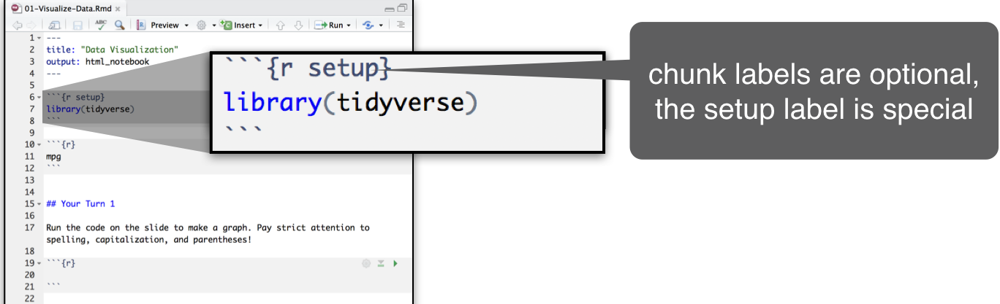

---
output:
  xaringan::moon_reader:
    self_contained: false
    lib_dir: libs
    css: xaringan-themer.css
    nature:
      ratio: 16:9
      highlightStyle: github
      highlightLines: true
    includes:
      in_header: fa.html
---

class: center middle  inverse


background-image: url("https://cran.r-project.org/Rlogo.svg")


---


```{r setup, include=FALSE}
library(tidyverse)
library(countdown)

knitr::opts_chunk$set(
  warning = FALSE, 
  message = FALSE, 
  echo = FALSE,
  fig.retina = 8)
```

class: center top 

### Your Turn
.left[
- Go here and log in for the class materials
]


---

class: center top 

# R - the language


---

class: center top 

# R - the language


---

class: center top 

# R - the language


---

class: center middle inverse

### Anything that *is* anything in R is an *object*

### Anything that *does* anything in R is a *function*

---

class: center top 

# Warm Up


---

class: center top 

# Warm Up


---

class: center top 

# Warm Up


---

class: center top 

# Warm Up


---

class: center top 

# Warm Up


---

class: center top 

# Warm Up


---

class: center middle inverse

# R Packages

---

class: center middle

background-image: url("img/packages.png")
background-size: cover
---

class: center middle

background-image: url("img/tidyverse.png")
background-size: cover

---

class: left top
.center[
# Your turn
]

- Navigate to the 'dementia' project in RStudio Cloud
- Type the code below into the 'console' and press enter after each line
- Choose which 'theme' you like for your IDE

```{r eval=FALSE, echo=TRUE}
library(rsthemes)
install_rsthemes()
try_rsthemes()
```

```{r}
solarized <- xaringanthemer:::solarized

countdown(minutes = 5, 
  seconds = 0,
  # Fanfare when it's over
  play_sound = TRUE,
  # Set timer theme to match solarized colors
  color_border              = solarized$magenta,
  color_text                = solarized$magenta,
  color_running_background  = solarized$cyan,
  color_running_text        = solarized$base02,
  color_finished_background = solarized$red,
  color_finished_text       = solarized$base3)
```
---
class: center middle


[Source: Introduction to Data Science in the Tidyverse](https://github.com/rstudio-conf-2020/data-science-tidy)
---
class: center middle


[Source: R-ladies Newcastle](https://twitter.com/RLadiesNCL/status/1138812826917724160/photo/1)

---

class: center middle inverse

# R Markdown

---
class: left top
.center[
# Your turn
]

- Open the exercises.Rmd file in the introduction folder
- Read throught the file and do everything it tells you to do


```{r}
countdown(minutes = 10)
```

---

class: center top

### R markdown:  An authoring format for data science


---

class: center top

background-image: url("img/code-chunk.png")
background-size: cover

---

class: left top

.center[
# Your turn
]

- Add a setup chunk to the top of exercises.Rmd 
- Use it to load the tidyverse package
- Uncomment and run the ggplot2 chunk at the bottom of your file



---
class: left middle

<div style="width:100%;height:0;padding-bottom:48%;position:relative;"><iframe src="https://giphy.com/embed/axu6dFuca4HKM" width="100%" height="100%" style="position:absolute" frameBorder="0" class="giphy-embed" allowFullScreen></iframe></div><p><a href="https://giphy.com/gifs/axu6dFuca4HKM">via GIPHY</a></p>

---

class: left top

.center[
# Your turn
]

- Navigate to visualize folder
- Open exercises.Rmd
- Add a setup chunk that loads the tidyverse packages
