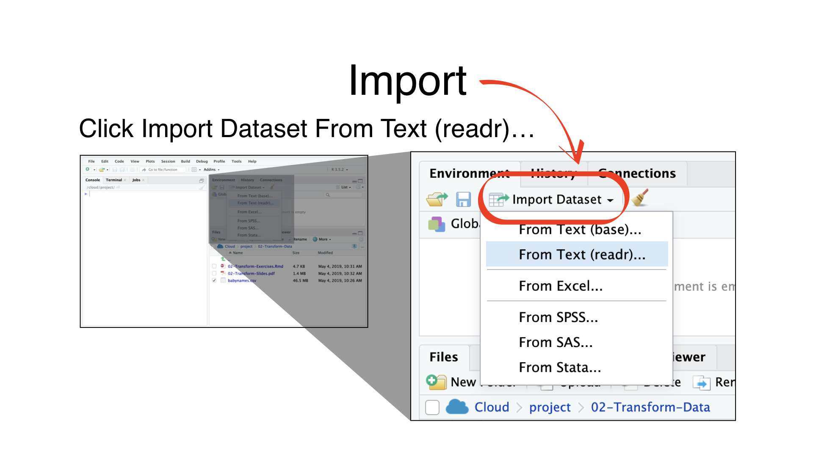
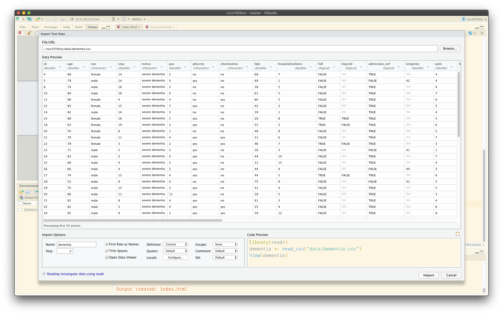
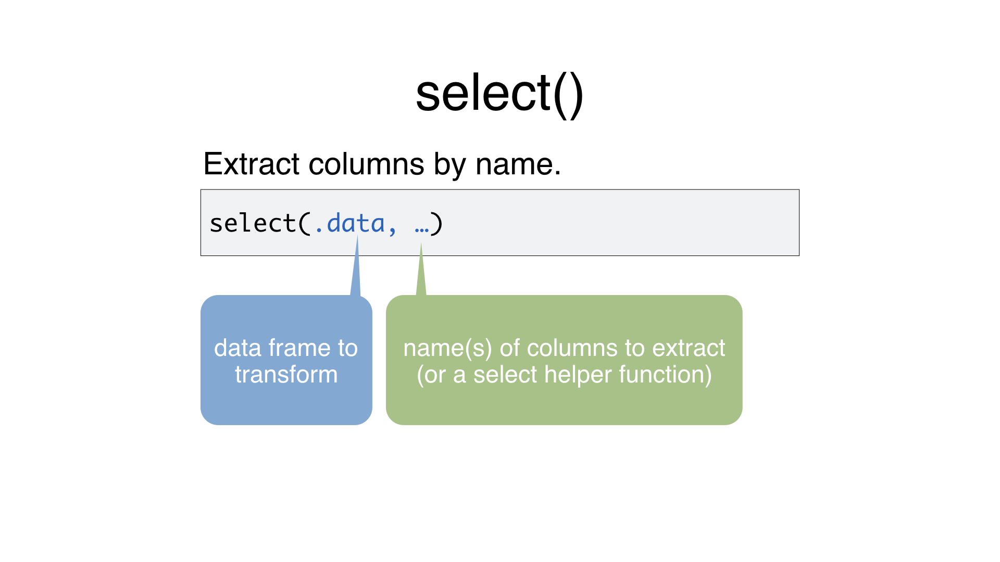
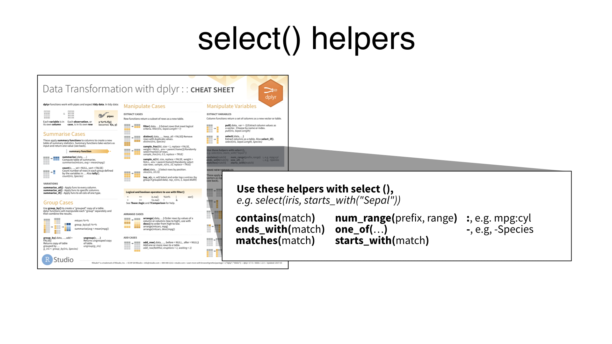
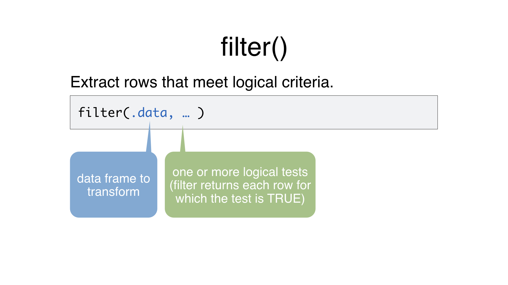
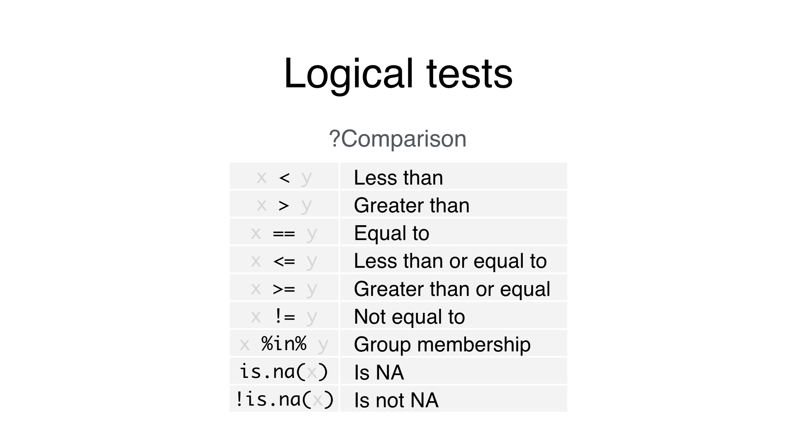
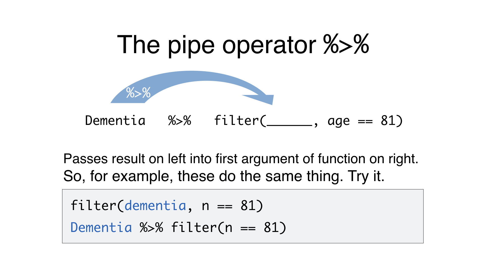
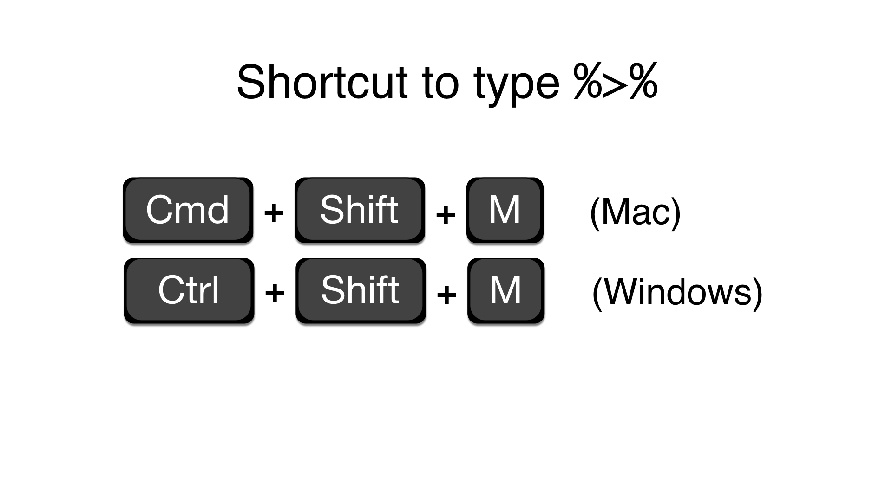

---
output:
  xaringan::moon_reader:
    self_contained: false
    lib_dir: libs
    css: xaringan-themer.css
    nature:
      ratio: 16:9
      highlightStyle: github
      highlightLines: true
    includes:
      in_header: fa.html
---

class: center middle hide-count inverse


## Transforming data with


---


```{r setup, include=FALSE}
library(tidyverse)
library(countdown)
library(gtsummary)
dementia <- readRDS(here::here("data/dementia.Rds"))

knitr::opts_chunk$set(
  warning = FALSE, 
  message = FALSE, 
  echo = FALSE,
  fig.retina = 8)
```

class: left top
.center[
## Your Turn 0
]

- Download the exercises.Rmd file (link below or in 'Workshop material' page)
- Upload it to your Rstudio cloud `dementia` project, saving it in a folder called 'transform'

```{r}
xfun::embed_file(here::here("static", "slides", "transform", 'exercises.Rmd'))
```


---

class: center middle hide-count inverse


# Importing data <i class="fad fa-file-import"></i>

---
class: center middle



---
class: center middle

## But is this reproducible?
---
class: top center

### Code is in bottom right box



---
class: center middle

## One complication

---
class: left top
.center[
## Working directory
]

- R associated itself with a folder (i.e. a 'directory') on your computer
- This folder is known as your 'working directory'
- When you save files, they will be saved in your 'working directory'
- When you **load** files, R will look for them there
- Working directory is not the same as .Rmd directory

---
class: center middle inverse

## The *here* package to the rescue

---
class: center middle

## here::here("data", "dementia.csv")

---
class: left top
.center[
## Your Turn 1
]

- Download a csv or excel file (your choice) of the dementia dataset from the workshop webpage
- Upload it to RStudio cloud into a new folder called 'data'
- Import the data set using the GUI. Does it run?
- Try the code approach using the here package. 

```{r}
solarized <- xaringanthemer:::solarized

countdown(minutes = 5, 
  seconds = 0,
  # Fanfare when it's over
  play_sound = TRUE,
  # Set timer theme to match solarized colors
  color_border              = solarized$magenta,
  color_text                = solarized$magenta,
  color_running_background  = solarized$cyan,
  color_running_text        = solarized$base02,
  color_finished_background = solarized$red,
  color_finished_text       = solarized$base3)
```

---

class: center middle hide-count inverse

# dplyr

### A package that transforms data

---

class: center middle

### select() - extract variables
### filter() - extract cases
---

class: center middle inverse

# select()

---

class: center middle




---

class: center middle
## select()

.pull-left[
```{r echo=TRUE, eval=FALSE}
dementia
```

```{r}
dementia %>% 
reactable::reactable(
                     resizable = TRUE, 
              showPageSizeOptions = TRUE, 
              onClick = "expand", 
              highlight = TRUE,
              
              sortable = TRUE,
              defaultPageSize = 4, 
              compact=TRUE)
```

]


.pull-right[
```{r echo=TRUE, eval=FALSE}
select(dementia, id, age) 
```

```{r}
select(dementia, id, age) %>% 
reactable::reactable(
                     resizable = TRUE, 
              showPageSizeOptions = TRUE, 
              onClick = "expand", 
              highlight = TRUE,
              
              sortable = TRUE,
              defaultPageSize = 8, 
              compact=TRUE)
```

]

---
class: left top
.center[
## Your Turn 2
]

- Alter the code just to select the mmse column

```{r echo=TRUE, eval=FALSE}
select(dementia, id, age) 
```

```{r}
countdown(minutes = 2)
```

---

class: left top
.center[
## select() helpers

Select range of columns

]

```{r echo=TRUE, eval=FALSE}
select(dementia, age:mmse)
```

.center[Select every column but]

```{r echo=TRUE, eval=FALSE}
select(dementia, -sex)
```

.center[Select columns that start with]

```{r echo=TRUE, eval=FALSE}
select(dementia, starts_with("QD"))
```

.center[Select columns that end with]

```{r echo=TRUE, eval=FALSE}
select(dementia, starts_with("res"))
```

.center[Select columns whose name contains]

```{r echo=TRUE, eval=FALSE}
select(dementia, contains("_"))
```

---

class: left top



---

class: center middle inverse

# filter()

---

class: center middle



---

class: center middle
## filter()

.pull-left[
```{r echo=TRUE, eval=FALSE}
dementia
```

```{r}
dementia %>% 
reactable::reactable(
                     resizable = TRUE, 
              showPageSizeOptions = TRUE, 
              onClick = "expand", 
              highlight = TRUE,
              
              sortable = TRUE,
              defaultPageSize = 4, 
              compact=TRUE)
```

]


.pull-right[
```{r echo=TRUE, eval=FALSE}
filter(dementia, mmse=="severe dementia") 
```

```{r}
filter(dementia, mmse=="severe dementia")  %>% 
reactable::reactable(
                     resizable = TRUE, 
              showPageSizeOptions = TRUE, 
              onClick = "expand", 
              highlight = TRUE,
              
              sortable = TRUE,
              defaultPageSize = 4, 
              compact=TRUE)
```

]

---

class: center top hide-count 

## Common mistake


.pull-left[
.left[
```{r eval=FALSE, echo=TRUE}
filter(dementia, mmse="severe dementia")
```
]
]

.pull-right[

# ERROR <i class="fad fa-exclamation-triangle"></i>

]
<br><br><br>

## Need to use double equal sign **==**

```{r eval=FALSE, echo=TRUE}
filter(dementia, mmse=="severe dementia")
```

---

class: center middle



---
class: left top
.center[
## Your Turn 3
]

Use `filter`, `dementia`, and the logical operators to find:

- All of the patients where length of stay is greater than or equal to 5
- All of the patients who had both chemical *and* physical restraints

```{r}
countdown(minutes = 5)
```
---

class: center middle inverse

#  %>% 

---


---


---
class: left top
.center[
## Your Turn 4
]

### Use  %>% to write a sequence of functions that:

- All of the patients where length of stay is greater than or equal to 5
- All of the patients who had both chemical *and* physical restraints

```{r}
countdown(minutes = 5)
```
---

class: center middle inverse

# mutate()

---

class: left middle

.center[
## mutate() to create new columns
]
.pull-left[
```{r echo=TRUE, eval=FALSE}
dementia
```

```{r}
dementia %>% 
reactable::reactable(
                     resizable = TRUE, 
              showPageSizeOptions = TRUE, 
              onClick = "expand", 
              highlight = TRUE,
              
              sortable = TRUE,
              defaultPageSize = 3, 
              compact=TRUE)
```

]


.pull-right[
```{r echo=TRUE, eval=FALSE}
dementia %>% 
mutate(age_90 = age>=90) 
```

```{r}
dementia %>% 
mutate(age_90 = age>=90)  %>% 
reactable::reactable(
                     resizable = TRUE, 
              showPageSizeOptions = TRUE, 
              onClick = "expand", 
              highlight = TRUE,
              
              sortable = TRUE,
              defaultPageSize = 3, 
              compact=TRUE)
```

]

---
class: left top
.center[
## Your Turn 5
]

Use `mutate()` and `case_when` to create a variable called stay_category that assigns length of stay into the categories 'short' (1-3 days), 'moderate' (4-8 days) and 'long' (>8 days).

```{r eval = FALSE, echo=TRUE}
dementia <- dementia %>% 
  ______(stay_category = case_when(stay < _ ~ "short",
                                   stay < _ & ___ > _ ~ "moderate",
                                   ___ _ _ ~ ___)
         )

# check your result
dementia %>% 
  select(stay, stay_category)
```

```{r}
countdown(minutes = 5)
```


---

class: center middle inverse

# summarise()

---

class: left middle

.center[
## summarise() to compute table of summaries
]
.pull-left[
```{r echo=TRUE, eval=FALSE}
dementia
```

```{r}
dementia %>% 
reactable::reactable(
                     resizable = TRUE, 
              showPageSizeOptions = TRUE, 
              onClick = "expand", 
              highlight = TRUE,
              
              sortable = TRUE,
              defaultPageSize = 3, 
              compact=TRUE)
```

]


.pull-right[
```{r echo=TRUE, eval=FALSE}
dementia %>% 
summarise(total_falls = sum(fall), 
          oldest_participant = max(age)) 
```

```{r}
dementia %>% 
summarise(total_falls = sum(fall), oldest_participant = max(age))  %>% 
reactable::reactable(
                     resizable = TRUE, 
              showPageSizeOptions = TRUE, 
              onClick = "expand", 
              highlight = TRUE,
              
              sortable = TRUE,
              defaultPageSize = 3, 
              compact=TRUE)
```

]

---
class: left top
.center[
## Your Turn 6
]

Complete the code below to extract the rows where `chemicalres == "yes"`. Then use `summarise()` and `sum()` and `min()` to find:

1. The total number of females
2. The lowest number of hospitalisations

*(Hint: Be sure to remove each `_` before running the code)*

```{r eval = FALSE, echo=TRUE}
dementia ___ 
  filter(_______________________) ___
  ___________(total_female = ________, shorted_hospitalisation = _______)
```


```{r}
countdown(minutes = 5)
```


---

class: center middle hide-count inverse

# Statistical *infer*ence with

<a href="https://infer.netlify.com/index.html"></a>

---

class: center middle hide-count inverse

## Is age associated with use of physical restraints?
---

class: center middle

# The short way

---
class: left top

.center[
# Using t_test() function
]

```{r}
library(infer)
```

```{r echo=TRUE}
dementia  %>% 
t_test(response = age, explanatory = physres, order = c("yes", "no"))

```

---

class: center middle hide-count inverse


### the p-value is the probability of observing an event *as or more extreme* than the result in our sample *assuming the null hypothesis is true*

---
class: center middle

# The long way


---
class: left top

.center[
### 1. Calculate the mean difference in age between use of physical restraints *in our sample*
]

```{r echo=TRUE}
(mean_difference <- dementia %>% 
  specify(response = age, explanatory = physres) %>%
  calculate(stat = "diff in means", order = c("yes", "no")))
```

---
class: left top

.center[
### 2. Create null distribution
]
.pull-left[
```{r echo=TRUE}
null_distribution <- dementia %>%
  specify(response = age, explanatory = physres) %>%
  hypothesize(null = "independence") %>%
  generate(reps = 1000, type = "permute") %>%
  calculate(stat = "diff in means", 
            order = c("yes", "no"))
```
]

.pull-right[
```{r}
null_distribution %>% 
ggplot2::ggplot(aes(stat)) +
  geom_dotplot(binwidth=0.099, method='histodot', colour = "white", fill = "blue", alpha=0.3) +
  theme_minimal()+
  labs(x = "Difference in age between groups", 
       y = NULL, title = "")+
  geom_vline(xintercept = 0, size = 1, color = "black")+
      geom_vline(xintercept = mean_difference$stat, size = 1, color = "red", linetype = "dashed" )+
        coord_cartesian(clip="off")
```
]


---
class: left top

.center[
### 3. Determine the probability of observing an event *as or more extreme* than the result in our sample *assuming the null hypothesis is true*
]
.pull-left[
```{r echo=TRUE, eval = FALSE}
null_distribution <- dementia %>%
  specify(response = age, explanatory = physres) %>%
  hypothesize(null = "independence") %>%
  generate(reps = 1000, type = "permute") %>%
  calculate(stat = "diff in means", 
            order = c("yes", "no"))
```

```{r echo=TRUE}
null_distribution %>% 
  get_p_value(obs_stat = mean_difference, 
              direction = "two_sided")
```
]

.pull-right[

```{r echo=FALSE, eval=TRUE, fig.height=6}
null_distribution %>%
  ggplot2::ggplot(aes(stat)) +
  geom_dotplot(binwidth=0.099, method='histodot', colour = "white", fill = "blue", alpha=0.3) +
  theme_minimal()+
  labs(x = "Difference in age between groups", 
       y = NULL, title = "")+
  geom_vline(xintercept = 0, size = 1, color = "black")+
      geom_vline(xintercept = mean_difference$stat, size = 1, color = "red", linetype = "dashed" )+
  annotate("rect", xmin = mean_difference$stat, xmax = Inf, ymin = 0, ymax = Inf,
        alpha = .2, fill = "red") +
   annotate("rect", xmin = -mean_difference$stat, xmax = -Inf, ymin = 0, ymax = Inf,
        alpha = .2, fill = "red")
```
]

---
class: left top
.center[
## Your Turn 7
]

- Install the `infer` package by running `install.packages("infer")` in the console.
- Load the `infer` package so you can use its functions
- Use a t test to determine if length of stay is associated with sustaining a fall whilst in hospital


```{r}
countdown(minutes = 5)
```


---
class: center middle hide-count inverse


## Transforming data with


