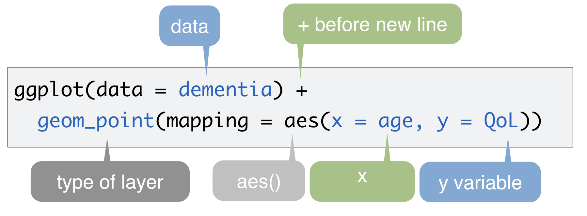
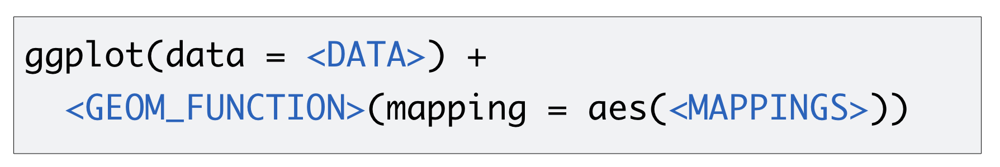
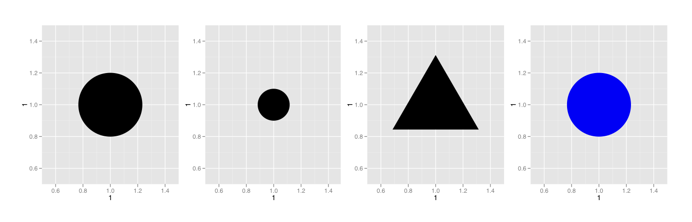
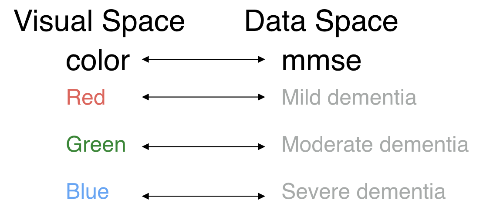
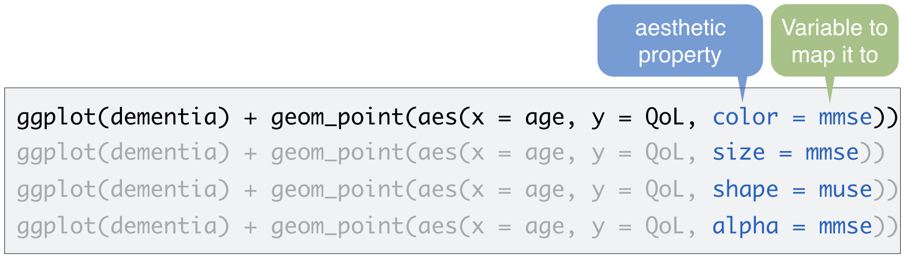
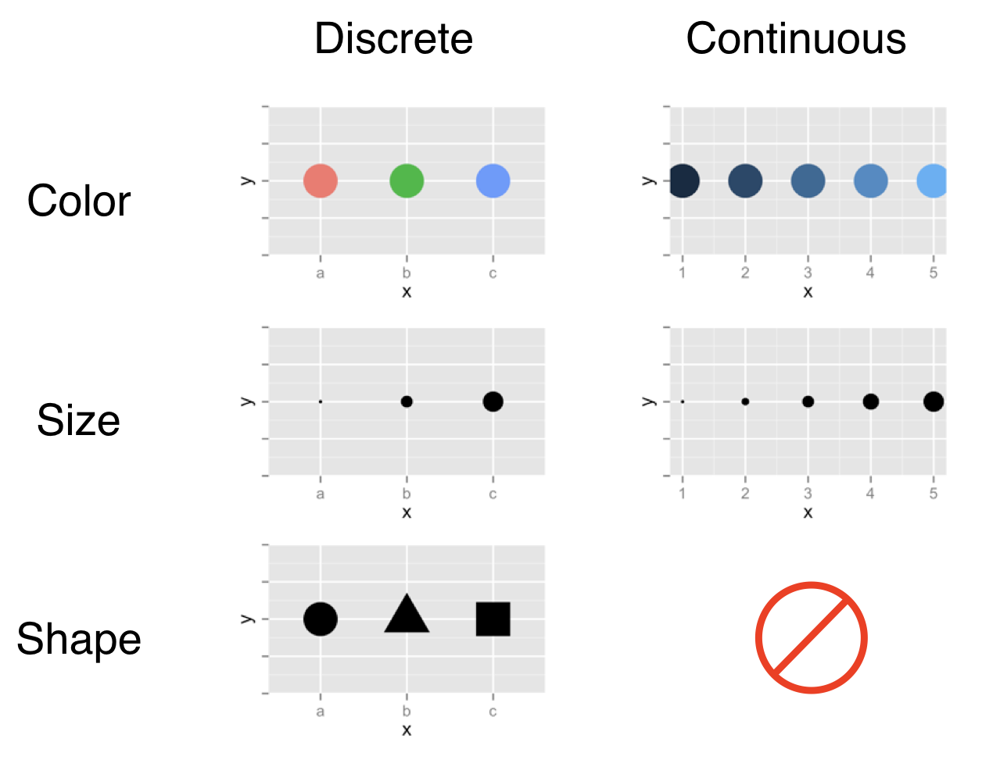
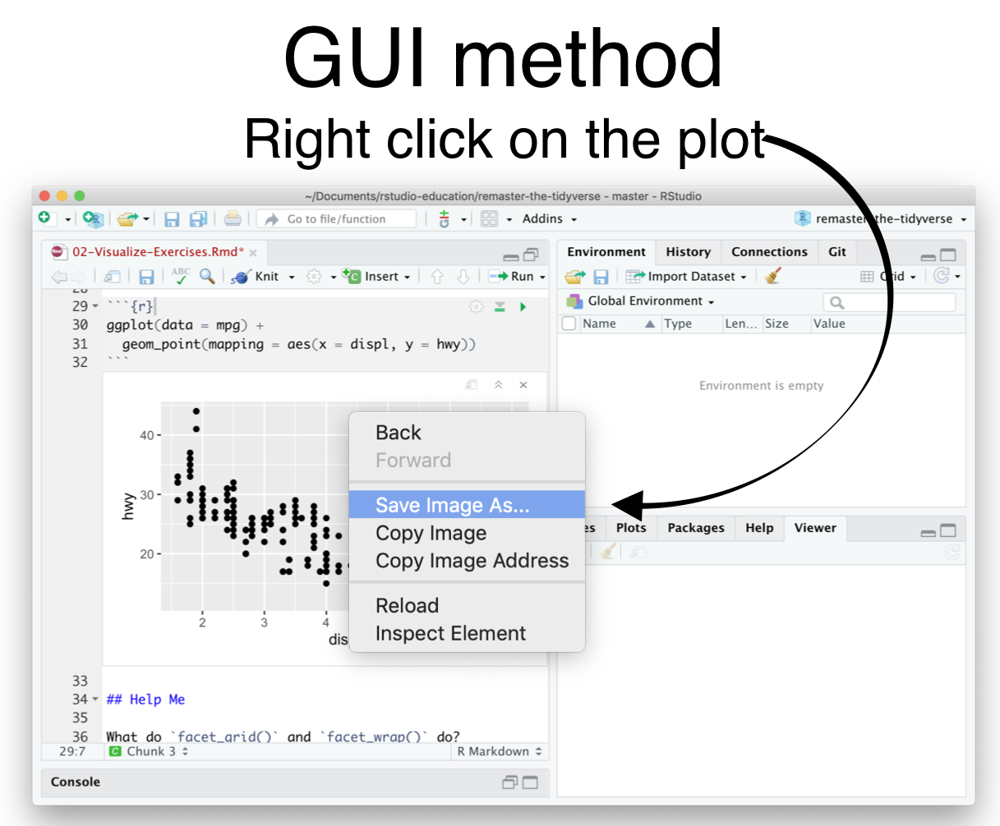
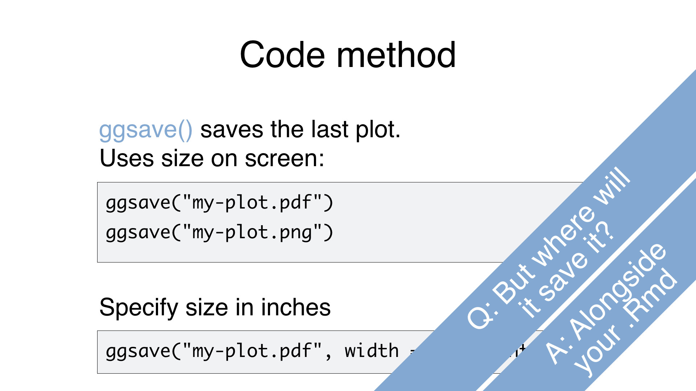
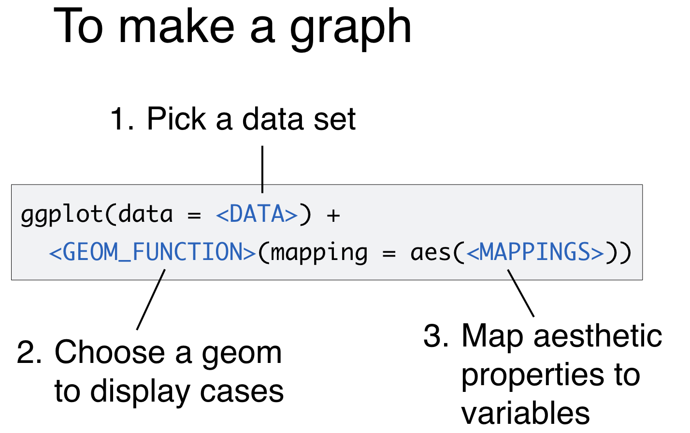

---
output:
  xaringan::moon_reader:
    self_contained: false
    lib_dir: libs
    css: xaringan-themer.css
    nature:
      ratio: 16:9
      highlightStyle: github
      highlightLines: true
    includes:
      in_header: fa.html
---

class: center middle hide-count inverse


## Visualizing data with


---


```{r setup, include=FALSE}
library(tidyverse)
library(countdown)
library(gtsummary)
dementia <- readRDS(here::here("data/dementia.Rds"))

knitr::opts_chunk$set(
  warning = FALSE, 
  message = FALSE, 
  echo = FALSE,
  fig.retina = 8)
```

class: center top hide-count

### Quality of life assessments for patients with dementia in hospital

.scroll-output[
```{r}
reactable::reactable(data = dementia,
                     resizable = TRUE, 
              showPageSizeOptions = TRUE, 
              onClick = "expand", 
              highlight = TRUE,
              filterable=TRUE,
              sortable = TRUE,
              defaultPageSize = 4, 
              compact=TRUE)
```
]
---

class: left top hide-count inverse

<center>
<h1> Your Turn 1</h1>
</center>

- Run this code in visualize.Rmd to make a graph. 
- Pay strict attention to spelling, capitalization, and parentheses!

```{r eval = FALSE, echo=TRUE}
ggplot(data = dementia) +
      geom_point(mapping = aes(x = age, y = QoL))
```

```{r}
solarized <- xaringanthemer:::solarized

countdown(minutes = 5, 
  seconds = 0,
  # Fanfare when it's over
  play_sound = TRUE,
  # Set timer theme to match solarized colors
  color_border              = solarized$magenta,
  color_text                = solarized$magenta,
  color_running_background  = solarized$cyan,
  color_running_text        = solarized$base02,
  color_finished_background = solarized$red,
  color_finished_text       = solarized$base3)
```

---
class: center top hide-count 


```{r eval = TRUE, echo=TRUE}
ggplot(data = dementia) +
      geom_point(mapping = aes(x = age, y = QoL))
```

---

class: center middle hide-count 

### 1. *Initialize* a plot with ggplot()

### 2. *Add* layers with geom_



---

class: center middle hide-count 

# A template



---

class: center middle hide-count inverse

# Mappings <i class="fad fa-map-pin"></i>

---

class: center middle hide-count 

>The greatest value of a picture is when it forces us to notice what we never expected to see.

<div align="right">
-John Tukey
</div>
---

class: center middle hide-count 

```{r eval = TRUE, echo=TRUE}
ggplot(data = dementia) +
      geom_point(mapping = aes(x = age, y = QoL))
```


---

class: center middle hide-count 

# Aesthetics




---

class: center middle hide-count 



---

class: center middle hide-count 

# Aesthetics


---

class: left top hide-count inverse

<center>
<h1> Your Turn 2</h1>
</center>

- In the next chunk, add color, size, alpha, and shape aesthetics to your graph. Experiment.  
- Do different things happen when you map aesthetics to  discrete and continuous variables?
- What happens when you use more than one aesthetic?

```{r}
countdown(minutes = 5)
```

---

class: center middle hide-count 



---

class: center top hide-count 

## Legend added automatically


.pull-left[
.left[
```{r colour, fig.show='hide', echo=TRUE}
ggplot(data = dementia) +
      geom_point(mapping = aes(x = age, 
                               y = QoL, 
                               colour = mmse))
```
]
]

.pull-right[

```{r ref.label='colour', echo=FALSE}

```

]

---

class: center top hide-count 

## Common mistake


.pull-left[
.left[
```{r eval=FALSE, echo=TRUE}
ggplot(data = dementia) +
      geom_point(mapping = aes(x = age, 
                               y = QoL), 
                               colour = mmse) #<<
```
]
]

.pull-right[

# ERROR <i class="fad fa-exclamation-triangle"></i>

]
<br><br><br>

## Colour was not mapped to an *aesthetic*<br>
Needs to be inside `aes()`

---

class: left top hide-count inverse

<center>
<h1> Your Turn 3</h1>
</center>

- Add the highlighted code to your graph. What does it do?

```{r eval=FALSE, echo=TRUE}
ggplot(data = dementia) +
      geom_point(mapping = aes(x = age, 
                               y = QoL,
                               colour = mmse))+
  labs(title = "Quality of life by age",#<<
       subtitle = "Data coloured by severity of dementia",#<<
       x = "Age (years)",#<<
       y = "Quality of Life (QALIDEM)",#<<
       color = "Severity of\nDementia",#<<
       caption = "Dementia assessed using MMSE")#<<

```


```{r}
countdown(minutes = 5)
```

---

class: left middle hide-count

.pull-left[
```{r eval=FALSE, echo=TRUE}
ggplot(data = dementia) +
      geom_point(mapping = aes(x = age, 
                               y = QoL,
                               colour = mmse))+
  labs(title = "Quality of life by age",#<<
       subtitle = "Data coloured by severity of dementia",#<<
       x = "Age (years)",#<<
       y = "Quality of Life (QALIDEM)",#<<
       color = "Severity of\nDementia",#<<
       caption = "Dementia assessed using MMSE")#<<

```
]

.pull-right[
```{r  echo=FALSE, eval=TRUE}
ggplot(data = dementia) +
      geom_point(mapping = aes(x = age, 
                               y = QoL,
                               colour = mmse))+
  labs(title = "Quality of life by age",
       subtitle = "Data coloured by severity of dementia",#<<
       x = "Age (years)",#<<
       y = "Quality of Life (QALIDEM)",#<<
       color = "Severity of\nDementia",#<<
       caption = "Dementia assessed using MMSE")#<<

```

]

---

class: center middle hide-count inverse

# Geoms <i class="fad fa-pencil-ruler"></i>

---

class: center middle hide-count

### How are these plots similar?

.pull-left[
```{r fig.height=5}
ggplot(data = dementia) +
      geom_point(mapping = aes(x = age, y = QoL))
```

]

.pull-right[

```{r fig.height=5}
ggplot(data = dementia) +
      geom_text(mapping = aes(x = age, y = QoL,
                              label = id))
```

]

Same x var, y var, data

---

class: center middle hide-count

### How are these plots different?

.pull-left[
```{r fig.height=5}
ggplot(data = dementia) +
      geom_point(mapping = aes(x = age, y = QoL))
```

]

.pull-right[

```{r fig.height=5}
ggplot(data = dementia) +
      geom_text(mapping = aes(x = age, y = QoL,
                              label = id))
```

]
.left[
>Different: geometric object (geom - the visual object used to represent the data)

]

---

class: center middle hide-count

background-image: url("img/cheatsheet-link.png")
background-size: contain

---

class: center middle hide-count

background-image: url("img/cheatsheet-geom.png")
background-size: contain

---

class: left top hide-count inverse

<center>
<h1> Your Turn 4</h1>
</center>

- Decide how to replace this scatterplot with one that draws boxplots. 
- Use the cheatsheet and just have a go with your best guess.

.pull-left[
```{r fig.height=4}
ggplot(data = dementia) +
      geom_point(mapping = aes(x = mmse, 
                               y = QoL))
```
]
.pull-right[

```{r fig.height=4}
ggplot(data = dementia) +
      geom_boxplot(mapping = aes(x = mmse, 
                               y = QoL))
```

]
.pull-left[
```{r eval=FALSE, echo=TRUE}
ggplot(data = dementia) +
      geom_point(mapping = aes(x = mmse, 
                               y = QoL))
```
]
```{r}
countdown(minutes = 5,
          top=0)
```

---

class: left top hide-count 

```{r echo=TRUE, eval=FALSE}
ggplot(data = dementia) +
      geom_boxplot(mapping = aes(x = mmse, y = QoL))#<<
```

.center[
```{r echo=FALSE}
ggplot(data = dementia) +
      geom_boxplot(mapping = aes(x = mmse, 
                               y = QoL))
```
]

---

class: left top hide-count inverse

<center>
<h1> Your Turn 5</h1>
</center>

- Make the histogram of length of hospital stay below
- Use the cheatsheet
- Hint: do not supply a y variable


```{r fig.height=5}
ggplot(data = dementia) +
 geom_histogram(mapping = aes(x = stay)) 
```


```{r}
countdown(minutes = 5)
```

---

class: left top hide-count

```{r eval=FALSE, echo=TRUE}
ggplot(data = dementia) +
 geom_histogram(mapping = aes(x = stay)) #<<
```


.center[
```{r echo=FALSE}
ggplot(data = dementia) +
 geom_histogram(mapping = aes(x = stay)) 
```

]

---

class: left top hide-count inverse

<center>
<h1> Your Turn 6</h1>
</center>

- Make the bar chart of mmse below
- Use the cheatsheet
- Hint: do not supply a y variable.

```{r fig.height=5}
ggplot(data = dementia) +
 geom_bar(mapping = aes(x = mmse, fill=mmse)) 
```


```{r}
countdown(minutes = 5)
```

---

class: left top hide-count

```{r eval=FALSE, echo=TRUE}
ggplot(data = dementia) +
 geom_bar(mapping = aes(x = mmse, colour=mmse)) #<<
```


.center[
```{r echo=FALSE}
ggplot(data = dementia) +
 geom_bar(mapping = aes(x = mmse, colour=mmse)) 
```

]

---

class: left top hide-count

```{r eval=FALSE, echo=TRUE}
ggplot(data = dementia) +
 geom_bar(mapping = aes(x = mmse, fill=mmse)) #<<
```


.center[
```{r echo=FALSE}
ggplot(data = dementia) +
 geom_bar(mapping = aes(x = mmse, fill=mmse)) 
```

]

---

class: left top hide-count

```{r eval=FALSE, echo=TRUE}
ggplot(data = dementia) +
 geom_bar(mapping = aes(x = mmse, fill=sex))  #<<
```


.center[
```{r echo=FALSE}
ggplot(data = dementia) +
 geom_bar(mapping = aes(x = mmse, fill=sex)) 
```

]


---

class: left top hide-count

```{r eval=FALSE, echo=TRUE}
ggplot(data = dementia) +
 geom_bar(mapping = aes(x = mmse, fill=sex), 
          position = "dodge")  #<<
```


.center[
```{r echo=FALSE}
ggplot(data = dementia) +
 geom_bar(mapping = aes(x = mmse, fill=sex), position = "dodge") 
```

]


---

class: center middle hide-count inverse

# Layers <i class="fad fa-layer-group"></i>

---

class: left top hide-count

<center>
<h1> Quiz</h1>
</center>

- What will this code do?

```{r eval=FALSE, echo=TRUE}
ggplot(data = dementia) +
  geom_boxplot(mapping = aes(x=mmse, y= QoL, colour = mmse)) +
    geom_point(mapping = aes(x= mmse, y=QoL, colour = mmse), 
               position = position_jitter(width = 0.2), alpha  = 0.3)
```

---

class: center top hide-count

## Each new geom adds a new layer

.left[
```{r eval=FALSE, echo=TRUE}
ggplot(data = dementia) +
  geom_boxplot(mapping = aes(x=mmse, y= QoL, colour = mmse)) +
    geom_point(mapping = aes(x= mmse, y=QoL, colour = mmse), 
               position = position_jitter(width = 0.2), alpha  = 0.3)
```
]

.center[

```{r echo=FALSE, fig.height=4}
ggplot(data = dementia) +
  geom_boxplot(mapping = aes(x=mmse, y= QoL, colour = mmse)) +
    geom_point(mapping = aes(x= mmse, y=QoL, colour = mmse), 
               position = position_jitter(width = 0.2), alpha  = 0.3)
```
]


---

class: center middle hide-count inverse

# Global vs Local mapping

---

class: left top hide-count

<center>
<h2>Mappings and data that appear in ggplot() will apply globally</h2>
</center>

```{r eval=FALSE, echo=TRUE}
ggplot(data = dementia, aes(x=mmse, y= QoL, colour = mmse)) + #<<
  geom_boxplot() +
    geom_point(position = position_jitter(width = 0.2), alpha  = 0.3)
```

.center[
```{r echo=FALSE, fig.height=4}
ggplot(data = dementia, aes(x=mmse, y= QoL, colour = mmse)) + #<<
  geom_boxplot() +
    geom_point(position = position_jitter(width = 0.2), alpha  = 0.3)
```

]

---

class: center middle hide-count inverse

# Saving plots <i class="fad fa-save"></i>

---

class: center middle hide-count 



---

class: center middle hide-count 



---

class: left top hide-count inverse

<center>
<h1> Your Turn 7</h1>
</center>

- Save your last plot and then locate it in your files pane 
- Download it (you may have to refresh the files list)

```{r}
countdown(minutes = 5)
```

---

class: center middle hide-count 



---

class: center middle hide-count inverse

# Quick prototyping <i class="fad fa-mouse"></i>

---

class: left middle hide-count

### 1. Run esquisse::esquisser() in the console panel

### 2. 'Load' the dataset

### 3. Try out some plots by dragging variables to coordinates

### 4. 'Export' code to Rmd document

---

class: left top hide-count inverse

<center>
<h1> Your Turn 8</h1>
</center>

- Run esquisse::esquisser() in the console and 
- Use it to create a bar chart of the number of patients who sustained a fall. 
- Export the code to produce the plot into the chunk below so that you can reproduce it more easily.

```{r eval=FALSE, echo=TRUE}
esquisse::esquisser()
```


```{r}
countdown(minutes = 15)
```

---

class: center middle hide-count inverse

# Summary tables <i class="fad fa-table"></i>

---

class: left middle hide-count

.pull-left[
```{r eval=FALSE, echo=TRUE}
dementia %>% 
  select(age, sex, stay, braden,
         QoL, pain, pas, physres, 
         chemicalres, fall, mmse) %>% 
  tbl_summary(by = mmse,
    statistic = list(all_continuous() ~ "{mean} ({sd})"),
    type = list(pain ~ "continuous"),
     missing = "no"
              )%>%
  italicize_labels()
```

]

.pull-right[

```{r echo=FALSE}
dementia %>% 
  select(age, sex, stay, braden,
         QoL, pain, pas, physres, 
         chemicalres, fall, mmse) %>% 
  tbl_summary(by = mmse,
    statistic = list(all_continuous() ~ "{mean} ({sd})"),
    type = list(pain ~ "continuous"),
     missing = "no"
              )%>%
  italicize_labels()
```

]
---
class: left top hide-count inverse 

<center>
<h1> Your Turn 9</h1>
</center>

Modify the code below to:

- Show participant characteristics by those who did or did not sustatin a `fall`
- Include the number of hospitalizations in the past year as a rows
- Download the table

```{r echo=TRUE, eval=FALSE}
dementia %>% 
  select(age, sex, stay, braden,
         QoL, pain, pas, physres, 
         chemicalres, fall, mmse) %>% 
  tbl_summary(by = mmse,
    statistic = list(all_continuous() ~ "{mean} ({sd})"),
    type = list(pain ~ "continuous"),
     missing = "no"
              )%>%
  italicize_labels()
```

```{r}
countdown(minutes = 10, top = 0)
```

---

class: center middle hide-count 


---
class: center middle hide-count inverse


## Visualizing data with

